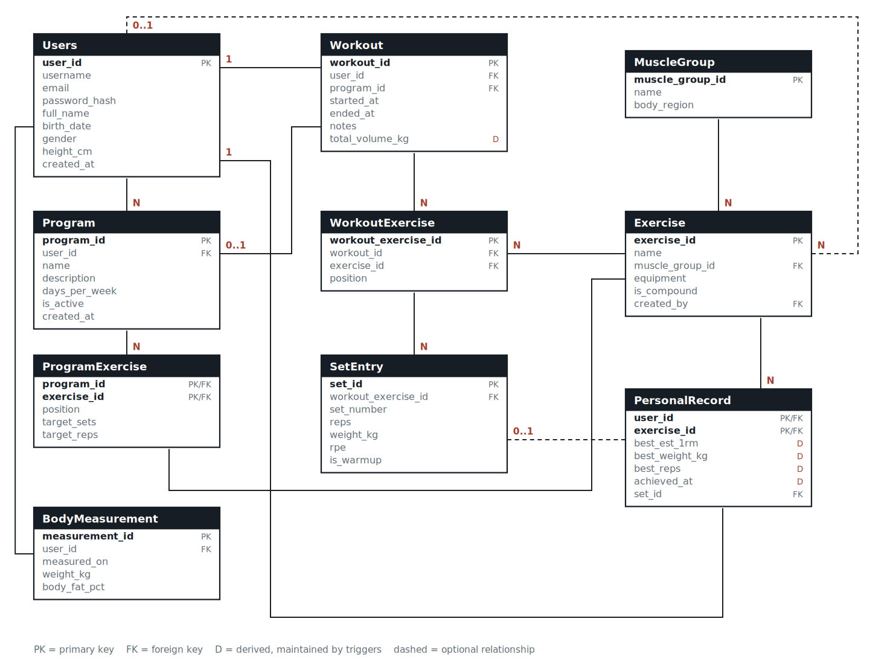

# Final Project Report

**Course:** DV1703, Blekinge Institute of Technology

**Students:** Hasan Alkousa — haao25@student.bth.se  
Asmaa Alkhader — asak25@student.bth.se

**Project:** GymLog — a training tracker system

---

## 1. Project Idea

### The problem

People who train with weights almost all keep a log, and almost all of them keep
it badly. The two common options are a paper notebook and a notes app. Both
record what happened, and neither answers the questions that actually matter
after a few months of training:

* Is the weight on my bench press going up, or has it been flat since May?
* I feel like I train my chest more than my back. Is that true, or does it just
  feel that way?
* I wrote this program six weeks ago. Am I actually following it?
* My lifts have stopped moving. Which ones, and for how long?

These are all questions about *history*, and history is exactly what a flat file
of notes cannot query. A set of weights and repetitions is a tiny piece of data,
but a year of training is tens of thousands of them, and the value is in the
aggregate rather than in any single row. That makes it a database problem.

### The users

The primary user is someone who trains with weights two to five times a week and
already logs their sessions somewhere. They are not necessarily a competitive
athlete; the assumption is only that they care whether the numbers go up. A
secondary user is a coach or training partner who wants to compare progress
across several people, which is why the system supports multiple users over the
same exercise catalogue rather than one isolated log per person.

### Why a database fits

Every question above is a join and an aggregation over the same three levels:
session -> exercise -> set. Once that structure is in a relational schema, a
question like "volume per muscle group over the last month" is a single query
instead of a scripted pass over a text file. The data also has real referential
structure — an exercise belongs to a muscle group, a set belongs to an exercise
within a session, a record belongs to a user and an exercise — which is precisely
what foreign keys exist to protect.

There is a second reason, more specific to this course. Several of the things
the application needs are *derived* values: the total volume of a session, and
the personal record for each exercise. These could be computed in Python every
time they are displayed, but they are read far more often than they are written,
and if the application computes them there is nothing stopping a bug from
displaying a record that was never lifted. In GymLog they are maintained by
triggers instead, so the invariant is enforced by the database rather than
trusted to the application. This is discussed further in Section 4.

### Main features

1. Register and log in; each user sees only their own training.
2. Build training programs (an ordered list of exercises with target sets and
   repetitions).
3. Start a session — either empty, or generated from a program in one call.
4. Log every set as weight × repetitions, with optional RPE and a warm-up flag.
5. Automatic personal records, based on estimated one-rep max.
6. Statistics: week-by-week progression per exercise, volume per muscle group,
   training consistency, program adherence, and a relative-strength ranking
   across users.
7. Body weight tracking, used both as its own chart and as the denominator in the
   relative-strength ranking.

### Source of data

The exercise catalogue (11 muscle groups, 27 exercises) is real data entered by
hand in `sql/03_seed_static.sql`. The training history is generated by
`seed_data.py`, which creates six users with 20 weeks of training each — 448
sessions and 7 252 sets in total. The generator is not random noise: it models
progressive overload, so weights creep upwards week by week, with one deload
week, occasional missed sessions, occasional skipped exercises, and two lifts
that deliberately plateau after week nine. Without that structure the statistics
queries would have nothing meaningful to find.

---

## 2. Logical Model



### Entities and why they exist

**Users** is the owner of everything personal in the system. Programs, sessions,
body measurements and records all hang off it.

**MuscleGroup** and **Exercise** are the shared catalogue. They are deliberately
*not* owned by a user: if every user had their own copy of "Back Squat" it would
be impossible to compare two lifters on the same exercise, which query Q5
depends on. `Exercise.created_by` is a nullable foreign key to Users — `NULL`
means the exercise ships with the system, a value means one user added it. This
gives custom exercises without duplicating the catalogue.

**Program** and **ProgramExercise** describe the *plan*. ProgramExercise is a
classic M:N relationship between Program and Exercise, resolved into its own
table because the relationship itself carries attributes: position in the
workout, target sets and target repetitions.

**Workout**, **WorkoutExercise** and **SetEntry** describe what *actually
happened*. The three-level split is the core design decision of the model. A
session contains several exercises; an exercise within that session contains
several sets. Flattening this into one table (one row per set with a session
timestamp repeated on each row) would work, but it would make "how many
exercises were in this session" an awkward `COUNT(DISTINCT …)` and would leave
nowhere to record the order in which exercises were performed. SetEntry is
effectively a weak entity: a set has no meaning outside the exercise-within-a-
session that contains it, which is why it cascades on delete.

**BodyMeasurement** is a simple weekly weigh-in, one row per user per date.

**PersonalRecord** is derived data. There is exactly one row per (user,
exercise) pair, holding the best estimated one-rep max that user has ever
achieved on that exercise. Nothing in the application writes to this table.

### Relationships and cardinalities

| Relationship | Cardinality | Note |
|---|---|---|
| Users – Program | 1 : N | A program belongs to exactly one user |
| Users – Workout | 1 : N | |
| Users – BodyMeasurement | 1 : N | Unique per (user, date) |
| Users – PersonalRecord | 1 : N | |
| Users – Exercise | 1 : N, optional | Only for user-created exercises |
| MuscleGroup – Exercise | 1 : N | Every exercise has exactly one primary muscle group |
| Program – ProgramExercise – Exercise | M : N | Resolved, carries attributes |
| Program – Workout | 0..1 : N | A session may be free-form |
| Workout – WorkoutExercise – Exercise | M : N | Resolved, carries position |
| WorkoutExercise – SetEntry | 1 : N | Weak entity |
| Exercise – PersonalRecord | 1 : N | |
| SetEntry – PersonalRecord | 0..1 : 1 | Points at the set that set the record |

### Design decisions worth motivating

**Why `Program` is optional on `Workout`.** Not every session follows a plan.
Making `program_id` nullable with `ON DELETE SET NULL` means deleting an old
program does not destroy the history of the sessions that used it. Deleting a
*user*, by contrast, cascades — their training history has no meaning without
them.

**Why the muscle group is on Exercise and not on SetEntry.** Muscle group is a
property of the exercise itself, not of a particular performance of it. Storing
it on SetEntry would be a transitive dependency and a normalisation violation:
the same exercise could end up classified two ways.

**Why the estimated one-rep max is not stored.** Every set could carry a
computed `est_1rm` column, but it is a pure function of `weight_kg` and `reps`,
both of which are already in the row. Storing it would be redundant and could
drift. It is a stored *function* instead (Section 4).

**Why total volume and personal records *are* stored.** These are aggregates
over many rows, not functions of a single row. Recomputing the best 1RM over a
user's entire history every time the records page is opened is an expensive scan
that grows without bound. Both are maintained incrementally by triggers, which
makes the read cheap and — more importantly — makes it impossible for the
application to write a wrong value.

---

## 3. Translating the Design to an SQL Schema

The translation is mechanical for most of the model, and the interesting parts
are where it is not.

**Entities become tables.** Each entity in Section 2 became one table with a
surrogate `INT AUTO_INCREMENT` primary key. Surrogate keys were chosen over
natural ones because none of the natural candidates are stable: an exercise can
be renamed, and a session has no natural identifier at all.

**1:N relationships become foreign keys** on the "many" side. `Workout.user_id`
references `Users`, `Exercise.muscle_group_id` references `MuscleGroup`, and so
on.

**M:N relationships become their own tables.** `ProgramExercise` and
`WorkoutExercise` are both resolutions of an M:N relationship. They differ in
one respect that is worth explaining. `ProgramExercise` uses a *composite*
primary key `(program_id, exercise_id)`, because the same exercise may only
appear once in a program. `WorkoutExercise` uses a surrogate key instead, with a
`UNIQUE (workout_id, exercise_id)` constraint providing the same guarantee —
because `SetEntry` needs to reference it with a single-column foreign key, and a
composite foreign key in the hottest table in the schema would be clumsy.

**The weak entity gets a compound uniqueness constraint.** `SetEntry` has its
own surrogate key, but also `UNIQUE (workout_exercise_id, set_number)`: there
cannot be two "set 3" of the same exercise in the same session.

**Delete behaviour is chosen per relationship**, not applied uniformly:

* `CASCADE` where the child is meaningless without the parent — sets under a
  session, program lines under a program, everything under a user.
* `RESTRICT` where the parent is shared reference data — an `Exercise` cannot be
  deleted while sessions still reference it, and a `MuscleGroup` cannot be
  deleted while exercises reference it.
* `SET NULL` where the reference is informative but not essential — a deleted
  program leaves its sessions intact.

**Domain constraints became `CHECK` constraints:** repetitions between 1 and
100, weight between 0 and 600 kg, RPE between 1 and 10, body weight between 30
and 300 kg, `days_per_week` between 1 and 7. One rule could not be expressed
this way — "0 kg is only allowed for a bodyweight exercise" depends on a
*different* table, and a `CHECK` constraint may only reference its own row. That
rule became a trigger instead.

**Indexes.** Beyond the automatic indexes on primary and foreign keys, one
composite index was added deliberately: `idx_workout_user_date (user_id,
started_at)`. Nearly every query in the application filters on a user and a date
range, and this is the index that serves that pattern.

**One view.** `v_set_full` flattens the set -> exercise -> session -> user chain,
because the same four-table join appears repeatedly. It is a convenience for the
application; the queries presented in Section 4 spell the joins out explicitly.

---

## 4. SQL Queries and Routines

### 4.1 Requirement coverage

| Requirement | Where it is met |
|---|---|
| At least five queries | Six, Q1–Q6 below |
| At least two multirelation queries | Q1 (5 tables), Q2 (3), Q3 (6), Q4 (5), Q5 (4) |
| Use of `JOIN` | All six; Q4 relies on `LEFT JOIN` for its meaning |
| Aggregation and/or grouping | All six; Q3 also uses `HAVING` |
| At least two of triggers / procedures / functions | All three: 4 triggers, 3 procedures, 2 functions |

### 4.2 The six queries

**Q1 — Where did the work actually go?**
Volume per muscle group over a period. Five tables: a set knows its
WorkoutExercise, which knows both the Workout (and therefore the user and date)
and the Exercise (and therefore the muscle group). Warm-up sets are excluded so
they do not inflate the totals.

```sql
SELECT  mg.name, mg.body_region,
        COUNT(DISTINCT w.workout_id)     AS sessions,
        COUNT(s.set_id)                  AS total_sets,
        SUM(s.reps)                      AS total_reps,
        ROUND(SUM(s.reps * s.weight_kg)) AS volume_kg
  FROM  SetEntry        s
  JOIN  WorkoutExercise we ON s.workout_exercise_id = we.workout_exercise_id
  JOIN  Workout         w  ON we.workout_id         = w.workout_id
  JOIN  Exercise        e  ON we.exercise_id        = e.exercise_id
  JOIN  MuscleGroup     mg ON e.muscle_group_id     = mg.muscle_group_id
 WHERE  w.user_id = ? AND s.is_warmup = FALSE
   AND  w.started_at >= (CURDATE() - INTERVAL ? DAY)
 GROUP BY mg.muscle_group_id, mg.name, mg.body_region
 ORDER BY volume_kg DESC;
```

**Q2 — Is this lift going up?**
Week-by-week progression for one exercise. `YEARWEEK(…, 3)` groups by ISO week,
which gives a stable weekly bucket regardless of where the month boundary falls.
`MIN(DATE(...))` recovers a human-readable label for each bucket. This query also
calls the stored function `fn_estimated_1rm`, so that a heavy triple and a light
set of ten can be compared on one scale.

```sql
SELECT  YEARWEEK(w.started_at, 3)                  AS iso_week,
        MIN(DATE(w.started_at))                    AS week_start,
        COUNT(DISTINCT w.workout_id)               AS sessions,
        ROUND(SUM(s.reps * s.weight_kg))           AS volume_kg,
        MAX(s.weight_kg)                           AS heaviest_kg,
        MAX(fn_estimated_1rm(s.weight_kg, s.reps)) AS best_est_1rm
  FROM  SetEntry        s
  JOIN  WorkoutExercise we ON s.workout_exercise_id = we.workout_exercise_id
  JOIN  Workout         w  ON we.workout_id         = w.workout_id
 WHERE  w.user_id = ? AND we.exercise_id = ? AND s.is_warmup = FALSE
   AND  w.started_at >= (CURDATE() - INTERVAL ? WEEK)
 GROUP BY YEARWEEK(w.started_at, 3)
 ORDER BY iso_week;
```

**Q3 — Which lifts have stopped moving?**
The most interesting query in the project. It finds exercises the user has
trained at least three times in the last eight weeks where the best result in
that window is *still below* their all-time record — in other words, two months
of work with nothing to show for it. This is the one place where `HAVING` is
essential rather than decorative: the condition compares an aggregate
(`MAX(...)` over the recent window) against a per-group value, which cannot be
expressed in `WHERE`. It also joins against `PersonalRecord`, the
trigger-maintained table, which is what makes the comparison cheap.

```sql
SELECT  e.name AS exercise, mg.name AS muscle_group,
        COUNT(DISTINCT w.workout_id)               AS sessions_8w,
        MAX(fn_estimated_1rm(s.weight_kg, s.reps)) AS best_1rm_8w,
        pr.best_est_1rm                            AS all_time_1rm,
        DATEDIFF(CURDATE(), DATE(pr.achieved_at))  AS days_since_pr
  FROM  SetEntry        s
  JOIN  WorkoutExercise we ON s.workout_exercise_id = we.workout_exercise_id
  JOIN  Workout         w  ON we.workout_id         = w.workout_id
  JOIN  Exercise        e  ON we.exercise_id        = e.exercise_id
  JOIN  MuscleGroup     mg ON e.muscle_group_id     = mg.muscle_group_id
  JOIN  PersonalRecord  pr ON pr.user_id     = w.user_id
                          AND pr.exercise_id = e.exercise_id
 WHERE  w.user_id = ? AND s.is_warmup = FALSE
   AND  w.started_at >= (CURDATE() - INTERVAL 8 WEEK)
 GROUP BY e.exercise_id, e.name, mg.name, pr.best_est_1rm, pr.achieved_at
HAVING  COUNT(DISTINCT w.workout_id) >= 3
   AND  MAX(fn_estimated_1rm(s.weight_kg, s.reps)) < pr.best_est_1rm
 ORDER BY days_since_pr DESC;
```

**Q4 — Am I following my own program?**
Compares the plan against reality. The chain of `LEFT JOIN`s is the whole point:
an inner join would silently drop exercises that were planned but never
performed, which are exactly the rows the user needs to see. `NULLIF` in the
denominator guards against division by zero when a program has not been trained
at all in the window.

```sql
SELECT  e.name AS exercise, pe.target_sets, pe.target_reps,
        COUNT(s.set_id)                    AS performed_sets,
        COALESCE(ROUND(AVG(s.reps), 1), 0) AS avg_reps,
        ROUND(100 * COUNT(s.set_id) / NULLIF(
              pe.target_sets * COUNT(DISTINCT w.workout_id), 0)) AS adherence_pct
  FROM  ProgramExercise pe
  JOIN  Exercise        e  ON pe.exercise_id = e.exercise_id
  LEFT JOIN Workout     w  ON w.program_id = pe.program_id AND w.user_id = ?
                          AND w.started_at >= (CURDATE() - INTERVAL ? DAY)
  LEFT JOIN WorkoutExercise we ON we.workout_id = w.workout_id
                              AND we.exercise_id = pe.exercise_id
  LEFT JOIN SetEntry    s  ON s.workout_exercise_id = we.workout_exercise_id
                          AND s.is_warmup = FALSE
 WHERE  pe.program_id = ?
 GROUP BY pe.exercise_id, e.name, pe.target_sets, pe.target_reps, pe.position
 ORDER BY pe.position;
```

**Q5 — Who is strongest, pound for pound?**
Ranks all users on one exercise by estimated 1RM divided by body weight.
Comparing absolute numbers across users would be meaningless; the interesting
figure is relative strength. The subquery in the `FROM` clause picks each user's
*most recent* weigh-in, which is a per-group maximum — a case where a derived
table is clearer than a correlated subquery in the `SELECT` list.

```sql
SELECT  u.username, u.full_name, pr.best_est_1rm AS est_1rm,
        latest.weight_kg AS bodyweight_kg,
        ROUND(pr.best_est_1rm / latest.weight_kg, 2) AS strength_ratio
  FROM  PersonalRecord pr
  JOIN  Users    u ON pr.user_id     = u.user_id
  JOIN  Exercise e ON pr.exercise_id = e.exercise_id
  JOIN  (SELECT b.user_id, b.weight_kg
           FROM BodyMeasurement b
           JOIN (SELECT user_id, MAX(measured_on) AS measured_on
                   FROM BodyMeasurement GROUP BY user_id) last
             ON b.user_id = last.user_id AND b.measured_on = last.measured_on) latest
        ON latest.user_id = u.user_id
 WHERE  e.exercise_id = ?
 ORDER BY strength_ratio DESC
 LIMIT 10;
```

**Q6 — Am I actually showing up?**
Sessions per week, average session length and weekly volume over the last twelve
weeks. This one aggregates only over `Workout`, which is possible precisely
because `total_volume_kg` is maintained by a trigger — without it, this query
would need the full three-table join and a `SUM` over every set.

```sql
SELECT  YEARWEEK(w.started_at, 3) AS iso_week,
        MIN(DATE(w.started_at))   AS week_start,
        COUNT(*)                  AS sessions,
        ROUND(AVG(TIMESTAMPDIFF(MINUTE, w.started_at, w.ended_at))) AS avg_minutes,
        ROUND(SUM(w.total_volume_kg)) AS volume_kg
  FROM  Workout w
 WHERE  w.user_id = ? AND w.ended_at IS NOT NULL
   AND  w.started_at >= (CURDATE() - INTERVAL ? WEEK)
 GROUP BY YEARWEEK(w.started_at, 3)
 ORDER BY iso_week;
```

### 4.3 Stored functions

**`fn_estimated_1rm(weight, reps)`** implements Epley's formula,
1RM ≈ *w* × (1 + *r*/30), declared `DETERMINISTIC NO SQL`. It converts any set
into a single comparable number. It is used in Q2 and Q3 and in the record
trigger, and putting it in the database rather than in Python means all three
use precisely the same definition — if the formula is ever changed, it changes
in one place.

**`fn_weekly_volume(user_id, date)`** returns the total kilograms a user lifted
in the ISO week containing the given date. Declared `READS SQL DATA`. It is used
twice in the dashboard query to compare the current week against the previous
one, which reads far better as two function calls than as two near-identical
subqueries.

### 4.4 Stored procedures

**`sp_start_workout_from_program(user_id, program_id, OUT workout_id)`** creates
a session and copies the entire program into it in one call, using
`INSERT … SELECT`. Doing this from Python would mean one round trip per
exercise, and a crash halfway through would leave a half-built session. The
procedure also validates that the program belongs to the calling user and raises
`SIGNAL SQLSTATE '45000'` if it does not — an ownership check that lives with
the data rather than in the web layer.

**`sp_log_set(workout_id, exercise_id, reps, weight, rpe, is_warmup)`** is the
most-used routine in the system. It looks up the `WorkoutExercise` row, creates
it if the user has added an exercise that was not in the program, computes the
next set number as `MAX(set_number) + 1`, and inserts. The set-number
calculation is the reason it exists: doing it in the application would be a
read-then-write race, whereas inside the procedure it is one statement in one
transaction.

**`sp_finish_workout(workout_id, notes)`** closes the session and deletes any
`WorkoutExercise` rows that never received a set, so a program exercise that was
skipped does not linger in the history as an empty block.

### 4.5 Triggers

| Trigger | Timing | Purpose |
|---|---|---|
| `trg_set_before_insert` | BEFORE INSERT on SetEntry | Rejects 0 kg unless the exercise is a bodyweight exercise |
| `trg_set_after_insert` | AFTER INSERT on SetEntry | Updates `Workout.total_volume_kg`; inserts or updates `PersonalRecord` |
| `trg_set_after_delete` | AFTER DELETE on SetEntry | Subtracts the removed set from the session volume |
| `trg_workout_before_update` | BEFORE UPDATE on Workout | Rejects an `ended_at` earlier than `started_at` |

`trg_set_before_insert` exists because the rule spans two tables and therefore
cannot be a `CHECK` constraint. It reads the exercise's equipment type through
`WorkoutExercise` and signals an error for an impossible entry.

`trg_set_after_insert` is the centrepiece. For every logged set it adds the set's
volume to its session, and then — for working sets only — computes the estimated
1RM and compares it against the existing record for that (user, exercise) pair,
inserting the first record or updating an existing one only when it has actually
been beaten. Because this is the *only* code path that writes to
`PersonalRecord`, the records page cannot display a record that was never
lifted. That guarantee is the argument for the whole approach.

The derived values were verified against a full recomputation from the raw sets
across all 448 generated sessions: zero discrepancies in session volume and zero
in the record table.

---

## 5. Implementation

The application is written in Python with Flask, using
`mysql-connector-python` directly. **No ORM is used.** Every statement is either
a hand-written string in `queries.py` or a `callproc` to one of the stored
procedures, and all values are bound with `%s` placeholders rather than
interpolated, which is both the correct way to pass parameters and the reason
the application is not open to SQL injection.

| Module | Responsibility |
|---|---|
| `db.py` | Connection pool, cursor context manager, `query_all` / `query_one` / `execute` / `call_proc` |
| `queries.py` | Every SQL statement in the application, Q1–Q6 included |
| `app.py` | Flask routes; contains no SQL of its own beyond one trivial insert |
| `seed_data.py` | Generates the training history |
| `templates/`, `static/` | Server-rendered interface |

Keeping all SQL in one module was a deliberate choice. It makes the queries
reviewable as a set, and it keeps the route handlers short enough that the
control flow is obvious.

The interface has seven pages: dashboard, session list, session detail (where
sets are logged), programs, records, statistics and body weight. Passwords are
hashed with Werkzeug's PBKDF2 implementation; sessions are handled by Flask's
signed cookies. Every route that touches user data re-checks ownership against
the session user, so a user cannot open another user's session by editing the
URL.

### Testing

The system was verified against a live MariaDB 10.11 instance:

* all four triggers, both functions and all three procedures behave as
  documented, including the four error cases that are supposed to be rejected;
* the trigger-maintained `total_volume_kg` matches a full recomputation for all
  448 sessions;
* the trigger-maintained `PersonalRecord` table matches a recomputation from raw
  sets for all 114 records;
* every route returns HTTP 200, and logging a heavy set correctly produces a new
  personal record on screen.

---

## 6. Discussion and Resources

### What was difficult

**Choosing where the derived data lives.** The first version computed session
volume in Python. It worked, but the number had to be recomputed on every page
that displayed it, and there were two code paths that could produce it. Moving
it into a column maintained by triggers removed the duplication, but it
introduced a new obligation: the `AFTER DELETE` trigger is not optional, because
without it a deleted set would leave the stored total permanently wrong. This is
the real trade-off with derived columns — they are cheap to read and easy to
corrupt, and every write path has to be covered.

**Composite versus surrogate keys.** `ProgramExercise` and `WorkoutExercise`
model the same shape of relationship but ended up with different key strategies.
The deciding factor was that `SetEntry` has to reference `WorkoutExercise`, and
a two-column foreign key in the largest table in the schema would have made
every query involving sets more verbose.

**`LEFT JOIN` and `COUNT`.** In Q4 the adherence percentage was initially wrong
because `COUNT(*)` counts the rows produced by an outer join, including the ones
padded with `NULL`. Switching to `COUNT(s.set_id)`, which ignores `NULL`s, fixed
it. This is an easy mistake to make and an easy one to miss, because the query
still returns plausible-looking numbers.

**Generating data that is actually testable.** The first version of the
generator picked weights at random, and the result was that Q3 — the stalled-lift
query — always returned zero rows, because random data never plateaus. The
generator was rewritten to model progressive overload with a deload week and two
deliberately stalling lifts. It is worth stating the general point: a query that
detects a pattern cannot be tested on data that does not contain the pattern.

### Limitations and future work

* There is no unit conversion; everything is in kilograms.
* The relative-strength ranking (Q5) has no privacy control — every user appears
  in every other user's ranking.
* Estimated 1RM using Epley's formula becomes unreliable above roughly twelve
  repetitions. A future version could switch formulas by repetition range.
* Rest timers, exercise notes and photo progress tracking were all considered
  and dropped to keep the scope of this project reasonable.

### Resources

The project uses Flask and `mysql-connector-python`; installation instructions
are in `README.md`. The full database, including routines, triggers and
generated data, can be restored from `sql/gymlog_dump.sql` in one command.

* Source code and database dump: `[GitHub/GitLab link]`
* Video demonstration: `[YouTube/Vimeo link]`
* Epley, B. (1985). *Poundage Chart.* Boyd Epley Workout. Lincoln, NE:
  Body Enterprises. — origin of the 1RM formula used in `fn_estimated_1rm`.

---

## Appendix A — Changelog

| Person | Task | Date |
|---|---|---|
| Hasan, Asmaa | Project idea, scope and choice of domain | |
| Hasan, Asmaa | E/R model and logical design | |
| Hasan | Translation to SQL schema, constraints and indexes | |
| Asmaa | Stored functions: estimated 1RM and weekly volume | |
| Hasan | Stored procedures: start session, log set, finish session | |
| Hasan | Triggers for derived volume and personal records | |
| Asmaa | Queries Q1, Q2 and Q6 | |
| Hasan | Queries Q3, Q4 and Q5 | |
| Asmaa | Data generator for the training history | |
| Hasan | Flask routes and database access layer | |
| Asmaa | Templates, stylesheet and interface | |
| Hasan, Asmaa | Testing and verification of derived data | |
| Asmaa | Report, sections 1-3 | |
| Hasan | Report, sections 4-6 | |
